# RVM.CodeLens - Manual do Usuario

> Analise Estatica de Codigo com Roslyn — Guia Completo de Funcionalidades
>
> Gerado em 26/04/2026 | RVM Tech

---

## Visao Geral

O **RVM.CodeLens** e uma plataforma de analise estatica de codigo .NET baseada em Roslyn.

**Recursos principais:**
- **Analise Roslyn** — metricas nativas do compilador .NET
- **Dashboard de qualidade** — score, trends e issues por categoria
- **Grafico de dependencias** — visualizacao interativa com deteccao de ciclos
- **Hotspots de risco** — combinacao de complexidade x frequencia de mudancas
- **Visao arquitetural** — conformidade com camadas e DDD

---

## 1. Pagina Inicial

Tela de entrada do RVM.CodeLens. Apresenta o sistema de analise estatica de codigo e permite iniciar uma nova analise informando o repositorio Git a ser inspecionado.

**Funcionalidades:**
- Formulario de entrada de repositorio Git (URL ou caminho local)
- Selecao de branch para analise
- Historico de analises recentes
- Indicadores de status do sistema

> **Dicas:**
> - Cole a URL do repositorio GitHub/GitLab diretamente no campo de entrada.
> - Repositorios privados requerem token de acesso configurado nas definicoes.

| Desktop | Mobile |
|---------|--------|
| 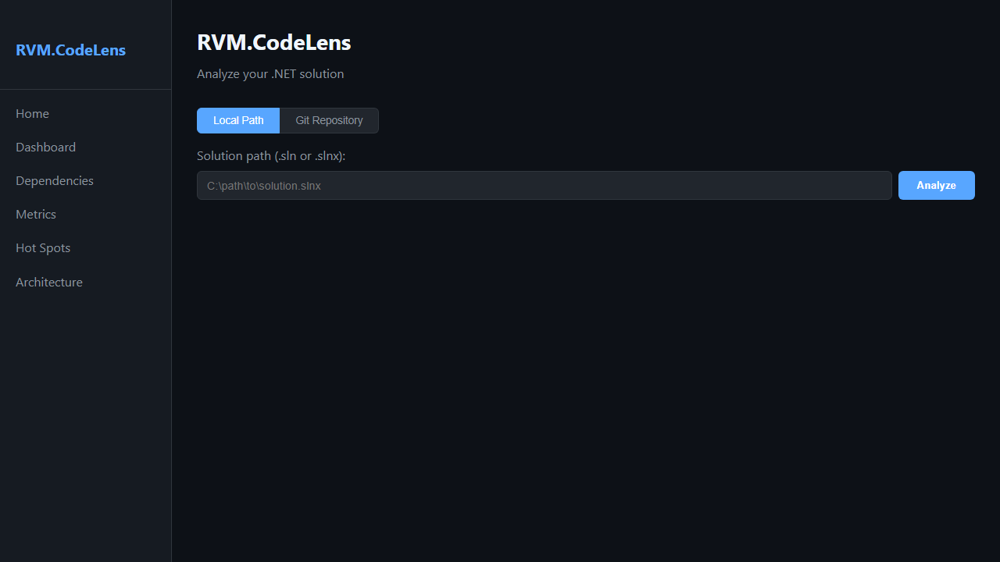 | 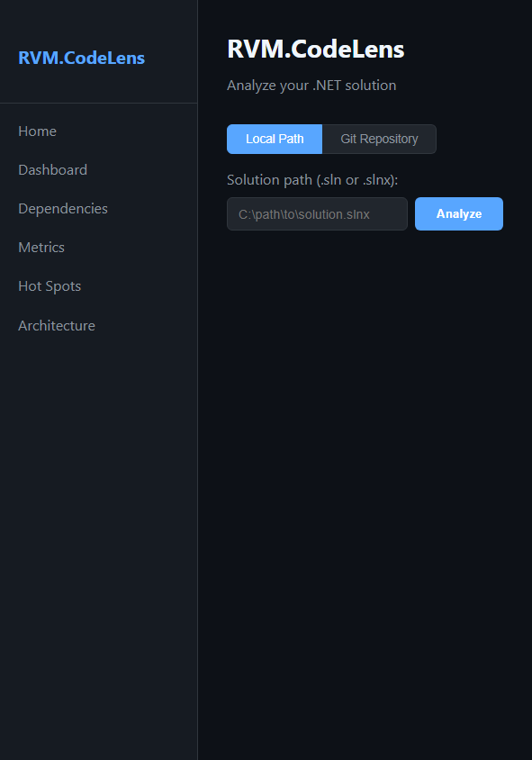 |

---

## 2. Dashboard de Analise

Painel central com resumo completo da analise do repositorio. Exibe score de qualidade, contagem de issues por severidade e evolucao historica.

**Funcionalidades:**
- Score de qualidade geral (0-100)
- Contagem de issues por categoria: bugs, complexidade, duplicacao, seguranca
- Grafico de evolucao de qualidade ao longo do tempo
- Top 5 arquivos com maior debito tecnico
- Resumo de cobertura de testes

| Desktop | Mobile |
|---------|--------|
| 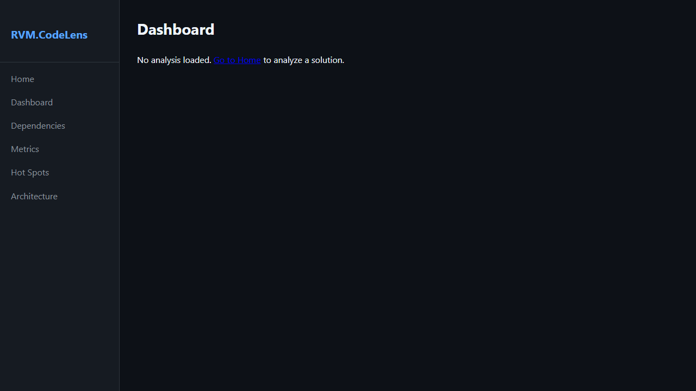 | 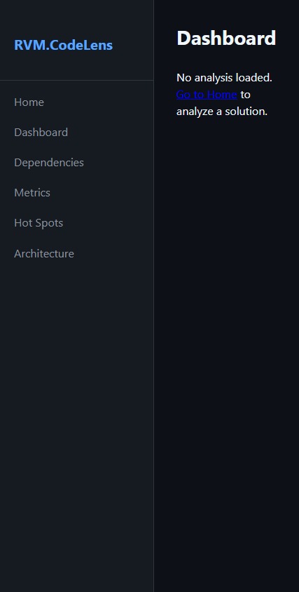 |

---

## 3. Metricas de Codigo

Analise detalhada das metricas de qualidade do codigo: complexidade ciclomatica, linhas por metodo, acoplamento entre classes e indice de manutenibilidade.

**Funcionalidades:**
- Complexidade ciclomatica por arquivo e metodo
- Linhas de codigo (LOC) e linhas comentadas
- Indice de manutenibilidade (0-100)
- Acoplamento aferente e eferente por classe
- Score CRAP (Change Risk Anti-Patterns)
- Filtro e ordenacao por qualquer metrica

> **Dicas:**
> - Metodos com complexidade ciclomatica acima de 10 sao candidatos a refatoracao.
> - Score CRAP acima de 30 indica alto risco de bugs ao alterar o codigo.

| Desktop | Mobile |
|---------|--------|
| 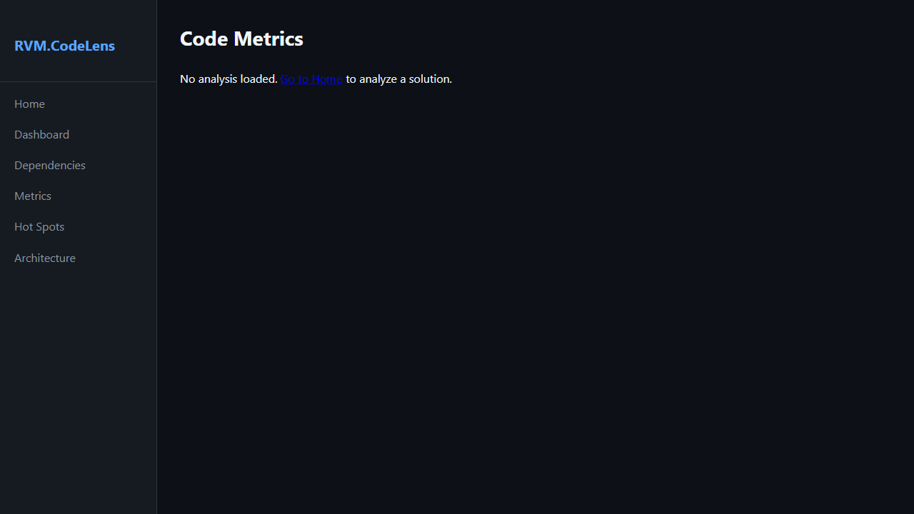 | 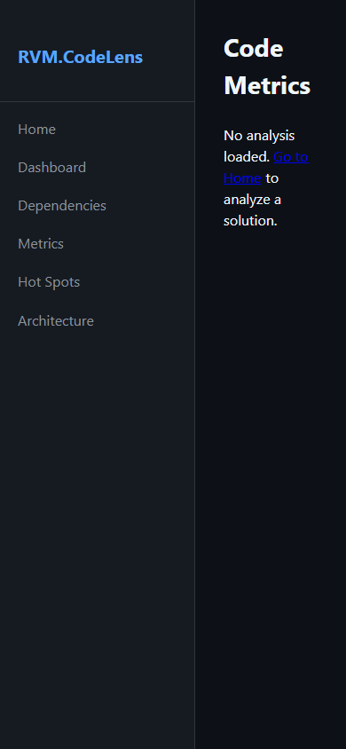 |

---

## 4. Grafico de Dependencias

Visualizacao interativa das dependencias entre modulos, namespaces e assemblies. Identifica ciclos de dependencia e acoplamento excessivo.

**Funcionalidades:**
- Grafico de dependencias interativo (zoom, pan, filtro)
- Deteccao automatica de ciclos de dependencia
- Agrupamento por namespace ou assembly
- Exportacao do grafico em SVG/PNG
- Tabela de dependencias com peso por acoplamento

> **Dicas:**
> - Ciclos de dependencia (indicados em vermelho) devem ser eliminados para melhorar a manutenibilidade.

| Desktop | Mobile |
|---------|--------|
| 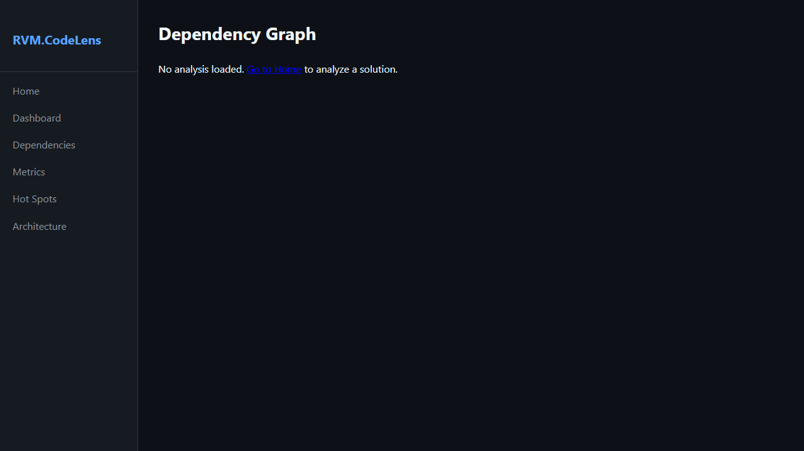 | 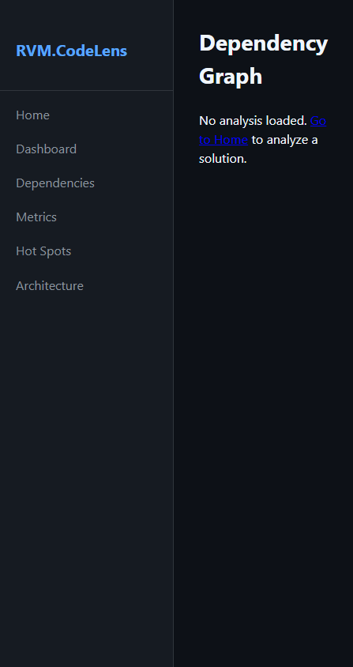 |

---

## 5. Hotspots de Risco

Identificacao dos arquivos e metodos de maior risco: combinacao de alta complexidade com alta frequencia de alteracoes no historico Git.

**Funcionalidades:**
- Mapa de calor (heatmap) de arquivos por risco
- Combinacao de metricas: complexidade x frequencia de commits
- Lista ordenada dos 20 maiores hotspots
- Historico de commits por arquivo
- Sugestoes de refatoracao priorizadas

> **Dicas:**
> - Comece a refatoracao pelos hotspots — eles concentram a maior parte dos bugs em producao.

| Desktop | Mobile |
|---------|--------|
| 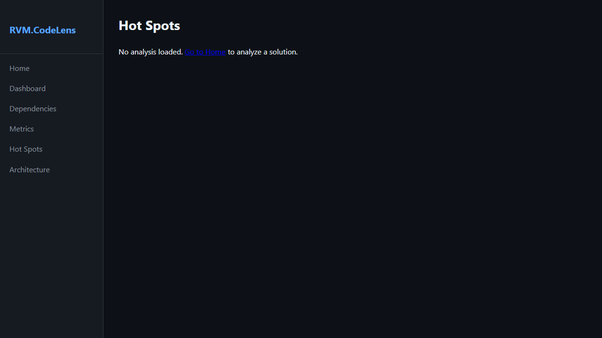 | 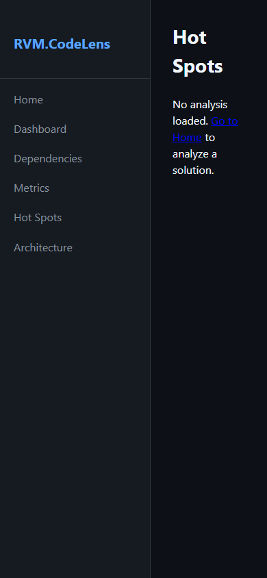 |

---

## 6. Visao de Arquitetura

Analise estrutural do projeto: camadas detectadas automaticamente, violacoes de arquitetura e conformidade com padroes estabelecidos.

**Funcionalidades:**
- Deteccao automatica de camadas (Domain, Application, Infrastructure, Presentation)
- Visualizacao de violacoes de dependencia entre camadas
- Conformidade com Clean Architecture / DDD
- Analise de responsabilidades por namespace
- Relatorio de violacoes exportavel

| Desktop | Mobile |
|---------|--------|
|  | 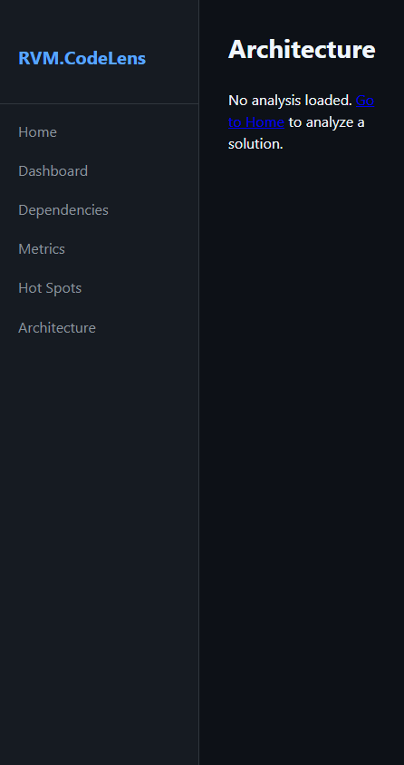 |

---

## Informacoes Tecnicas

| Item | Detalhe |
|------|---------|
| **Tecnologia** | ASP.NET Core + Blazor Web |
| **Motor de analise** | Microsoft Roslyn (C# Compiler Platform) |
| **Banco de dados** | PostgreSQL 16 |
| **Visualizacao** | D3.js (grafos de dependencias) |

---

*Documento gerado automaticamente com Playwright + TypeScript — RVM Tech*
